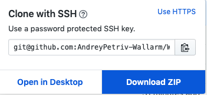

# Wallarm-API-to-ELK

This is PoC for retrieving data from Wallarm Cloud and sending it to the ELK stack.
The purpose of which is to verify that certain concepts of interaction with API are not only possible, but also easy to fulfill for real-world application, therefore it is a prototype that is designed to determine feasibility of such implementations.

## Getting Started

This project requires python3 and pip3 installed on your OS.

Clone project from this repo
```sh
git clone git@github.com:AndreyPetriv-Wallarm/Wallarm-API-to-ELK.git
```
Or download zip archive and unzip it



### Prerequisites

Things you need to install are python3 and the package installer (pip3) for Python installed by default.

Once installed, download required packages

```sh
username@laptop:~$  pip3 install -r requirements.txt
```

Elasticsearch should be installed and configured listening on *localhost:9200*

### Usage

```python 
python3 request.py
```
### Options
```sh
--batch - the script will use env variables
```
What are the environment variables it looks for?
- Mandatory
```sh
WALLARM_API
``` 
- Optional

Either
```
WALLARM_USERNAME
WALLARM_PASSWORD
```

OR

```
WALLARM_UUID
WALLARM_SECRET
```

If both sets presented the script will use UUID/SECRET to authenticate in a cloud.

Otherwise, interactive mode is on.

### What does the script do?

1. Login in Wallarm API
2. Make requests to the following endpoints
	* Attack
	* Hit
	* Details
	* Blacklist
	* Blacklist history
	* Vulnerability
3. Send JSON formatted data to Elasticsearch (*localhost:9200*)
4. Create attack.json, hit.json, details.json, blacklist.json, blacklist_history.json, vulnerabilities.json with the information of requested resources

## Deployment

### Start with
- [Elasticsearch]


[Elasticsearch]: <https://www.elastic.co/products/elasticsearch>
